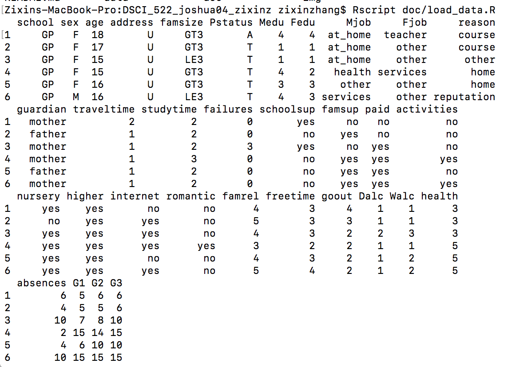

# Student_Performance
Data Analysis Project for Student Performance

## Members Name and MDS github ID: 

[Yenan Zhang](https://github.ubc.ca/joshua04)

[Zixin Zhang](https://github.ubc.ca/zixinz)

## Dataset
- **Source:** https://archive.ics.uci.edu/ml/datasets/Student+Performance

- **Description:** The dataset have 30 attribute information and the academic grades of students in math course and Portuguese language course. In this analysis, we will use the dataset of students in math course. The data set involved different kinds of data such as numeric variables, like G3, and categorical vairbales, like romantic. We are focusing on these two variables for our analysis: `G3` - final grade (numeric: from 0 to 20, output target) and `romantic` - with a romantic relationship (binary: yes or no) 

- **Proof of loading data:**

## Preliminary Question
- Question: Does romantic relationship influence student's academic performance?
- Type: Exploratory 

## Plan
First, perform EDA by making a violin and jitter plot of grades facetted on relationship status.

Second, perform a two group hypothesis tests of mean grade between students in relationships and student who are not.
- Null hypothesis: romantic relationship has no effect on final grade
- Alternative hypothesis: romantic relationshp will change student's final grade
- Significance level: choose alpha=0.05
      
## Summarize the data
We will make some data wrangling on our dataset. Then, we will create a table which have statistical summary for two groups of students, one group are the students in relationship and the other group is not. We will report the mean of final grade, sample size, standard deviation and 95% confidence interval of each group. We will also visualize our data by violin plot and jitter plot for the final grade and facetted on relationship status.   
