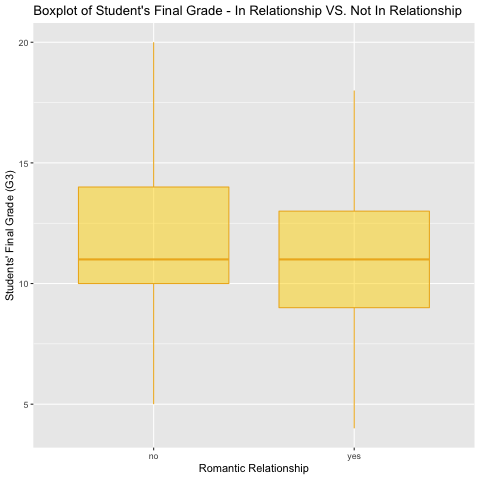
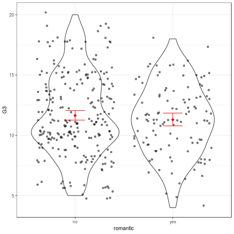

```{r setup, include=FALSE}
knitr::opts_chunk$set(echo = TRUE)
```

## Introduction
It's common to see that many high school students now are in romantic relationships. However, some parents think that having romantic relationship will influence teenagers' academic performances. In this project, we are interested in conducting research on an exploratory question - **Does romantic relationship influence student's academic performance?**. 

We choose the dataset [Student Performance Data Set](https://archive.ics.uci.edu/ml/datasets/Student+Performance) from UCL Machine Learning Repository. The dataset have 30 attribute information and three academic grades of students in math course and Portuguese language course. In this analysis, we will use the dataset of students in math course. Based on our question, We are only focusing on these two variables for our analysis: `G3` - final grade (numeric: from 0 to 20, output target) and `romantic` - with a romantic relationship (binary: yes or no).

```{r, echo = FALSE}
library(knitr)
data <- read.csv("../data/registered_student.csv")
```

*Table 1. Student Performance Dataset*
```{r, echo = FALSE}
kable(head(data))
```

## Visualization
In order to better visualize our dataset, we choose the boxplot because boxplot can provide us information on how our data spread and the how the means of two groups differ from each other.  

*Figure 1. five numbers summary of the variable G3 facetted by romantic*

```{r, echo = FALSE}

```

The boxplot tells us five number summary of `G3` among the two groups of students, with relationship and without relationship. The two groups of student have similar mean of the final grade, but we found that both the 25th percentile and 75th percentile of the group **no** are higher than that of the group **yes**. The maximum grade is in the group **no**, and the minimum grade is in the group **yes**.

## Data summary
In this part, we create a table which have statistical summary for in relationship and single groups of students. We will report the mean of final grade, sample size, 95% confidence interval of each group. We also visualize our data by a violin plot and jitter plot for the G3(final grade) and facetted on relationship status. The reason we choose a violin plot and jitter plot is that we want to see in which section there are higher probability to have more students getting the similar grades. Adding the error bar is to represent the variability of data in each group. 

*Table 2. Statistical Summary of the Data*
```{r, echo = FALSE}
library(knitr)
summary_table <- read.csv("../results/summary.csv")
kable(head(summary_table))
```

*Figure 2. Mean final grade for in-relationship and single groups of students. Error bars represent 95% confidence intervals generated by boostrapping.*


```{r, echo = FALSE}

```

In the single group, the estimate of the population parameter, the mean of G3(final grade) is 11.63265. Here, we used boostrapping to come up with a 95% confidence interval for the estimate, [11.19582, 12.03265]. The emean of G3(final grade) falls within this 95% confidence interval.

In the in-relationship group, the estimate of the population parameter, the mean of G3(final grade) is 11.28571. Here, we used boostrapping to come up with a 95% confidence interval for the estimate, [10.75871, 11.82143]. The mean of G3(final grade) falls within this 95% confidence interval.

## Hypothesis Testing and Results
To better explore the effect of having an romantic relationship, we conduct a two sample Welch's t-test ( [t-test reference](https://en.wikipedia.org/wiki/Welch%27s_t-test)): two samples have unequal variances and unequal sample sizes).

**Null hypothesis**: romantic relationship has no effect on final grade

**Alternative hypothesis**: romantic relationshp will effect student's final grade

**Significance level**: choose alpha = 0.05

*Table 3. Results of the t-test*
```{r, echo = FALSE}
library(knitr)
summary_table <- read.csv("../results/t_test.csv")
kable(head(summary_table))
```

From the t-test, we have t-statistics = 0.9971016	and p-value = 0.319687. Since p-value > alpha = 0.05, we fail to reject the null hypothesis that romantic relationship has no effect on final grade. 

## Limitations

1. Limited sample: Although we have a total of 357 observations, the number of samples in the two groups are unevenly. Specifically, we have 245 in non-relationship group and only 112 in romantic relationship group. The relative small number (112) in one test group probably reduce the power of our test

2. Limited comparison scale: The final grade has a range of 0 to 20, while this is enough for a test on group means, the difference is certainly less pronounced than a grade scale of 0 to 100. 

3. No control on other variables: Maybe those engaged in relationships all have significantly higher freetime than single students. So the added freetime canceled the negative effect of relationship. We don't know. 

## Future Directions
1. Increase sample size, especially for students in relationship groups
2. control on more variables, such as age, free-time, gender, etc. 

## External Sources
1. [Dataset](https://archive.ics.uci.edu/ml/datasets/Student+Performance)
2. [t-test reference](https://en.wikipedia.org/wiki/Welch%27s_t-test)
